# **Question & action à réaliser**

## Expliciter la procédure pas à pas pour installer un WebGUI sur votre LLM local (ubuntu)

Pour installer un **WebUI** , on a utiliser 2 methodes qui depends du besoin et de la configuration en face (si besoin faites les deux car dispo ).

### Méthode 1 : Classique via Docker

#### Partie 1

> [!NOTE]
> Utilisation :
>
> Disponible sur tout les appareils qui sont sur le même réseaux que le serveurs WebUI.

Prérequis :

> [!IMPORTANT]
> Les services Ollama et docker lancés.
>
> Sinon plus bas pour les installer.

Installation de Docker ( [Doc Officiel](https://docs.docker.com/engine/install/ubuntu/#install-using-the-repository)) :

```sh
# Installationn des paquet requis (ca-certificates= permet à curl de vérifier que la connexion HTTPS/ curl = télécharger des fichiers ou des clés depuis Internet en CLI) + Mises a jour Completes du Systemes
sudo apt update && sudo apt full-upgrade -y
sudo apt install ca-certificates curl

# Sert à créer un dossier sécurisé pour stocker les clés cryptographiques de dépôts de paquets.
sudo install -m 0755 -d /etc/apt/keyrings

# Télécharge la Clef GPG DOCKER + droit a tout le monde de lire la KEY
sudo curl -fsSL https://download.docker.com/linux/ubuntu/gpg -o /etc/apt/keyrings/docker.asc
sudo chmod a+r /etc/apt/keyrings/docker.asc

# Ajoute la source dans APT :
sudo tee /etc/apt/sources.list.d/docker.sources <<EOF
Types: deb
URIs: https://download.docker.com/linux/ubuntu
Suites: $(. /etc/os-release && echo "${UBUNTU_CODENAME:-$VERSION_CODENAME}")
Components: stable
Architectures: $(dpkg --print-architecture)
Signed-By: /etc/apt/keyrings/docker.asc
EOF
sudo apt update

# Installation maintenant de tout les composant de Dockers
sudo apt install docker-ce docker-ce-cli containerd.io docker-buildx-plugin docker-compose-plugin

```

Installation de Ollama ([Doc Officiel](https://docs.ollama.com/linux)) :

```sh
# Installationn des paquet requis (curl = télécharger des fichiers ou des clés depuis Internet en CLI)
sudo apt update && sudo apt full-upgrade -y
sudo apt install ca-certificates curl

# Telecharge un script et execute un script pour l'installation de Ollama
curl -fsSL https://ollama.com/install.sh | sh

## Optionel

# Télécharger une instance IA
ollama pull #nom de l'ia que vous vouluez

# Exécute une instance IA ( après l'avoir pull)
ollama run #nom de l'ia que vous vouluez

```

##### Partie 2

Installation du Web Ul:

```sh
sudo docker run -d \
  --network=host \
  -v open-webui:/app/backend/data \
  -e OLLAMA_BASE_URL=http://127.0.0.1:11434 \
  --name open-webui \
  --restart always \
  ghcr.io/open-webui/open-webui:main
```

Partie 3 :

###### Accéder à l'interface

Ouvrez votre navigateur sur :

* En local : [`http://localhost:8080`](http://localhost:8080) ( sur le serveur uniquement)
* Depuis une autre machine du réseau : `http://<IP_DE_VOTRE_SERVEUR>:8080`

_(Le premier compte créé sur l'interface sera automatiquement l'administrateur)._

#### _Méthode 2: Page Assist sur navigateur (seulement sur pc)_

_Prérequis:_

```sh
# Force Ollama à écouter sur toutes les interfaces réseau 
sudo mkdir -p /etc/systemd/system/ollama.service.d
sudo cat > /etc/systemd/system/ollama.service.d/override.conf<<EOL [Service]

Environment="OLLAMA_HOST=0.0.0.0"

Environment="OLLAMA_ORIGINS=*"

EOL

# Redémarre le services ollama 
sudo systemctl daemon-reload
sudo systemctl restart ollama
```

>[!NOTE]
> Page Assist est une extension open-source qui intègre vos modèles d’IA locaux (Ollama, LM Studio, etc.) directement dans votre navigateur via un volet latéral (sidebar) ou une interface dédiée.

##### Partie 1 .Télécharger l'extension

[Lien Chrome Web Store](https://chromewebstore.google.com/detail/page-assist-a-web-ui-for/jfgfiigpkhlkbnfnbobbkinehhfdhndo)

[Lien Mozilla🦊](https://addons.mozilla.org/fr/firefox/addon/page-assist/)

[Lien Edge](https://microsoftedge.microsoft.com/addons/detail/page-assist-a-web-ui-fo/ogkogooadflifpmmidmhjedogicnhooa)

##### Partie 2 : Configuration Page Assist

1. Après avoir téléchargé l'extension (dans mon cas sur un navigateur Chromium), lancez-la pour accéder à l'interface :

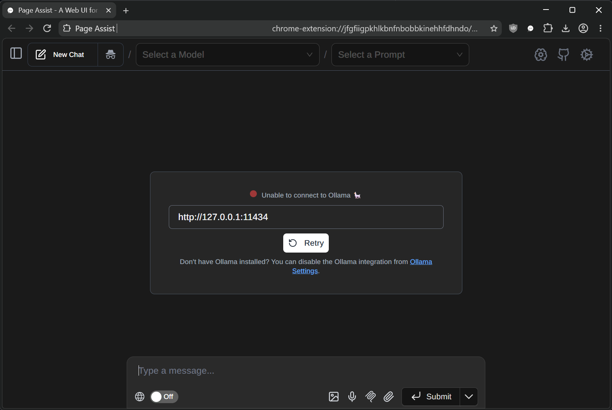

1. _Configuration du Page assist pour la sync entre Ul et Ollama_

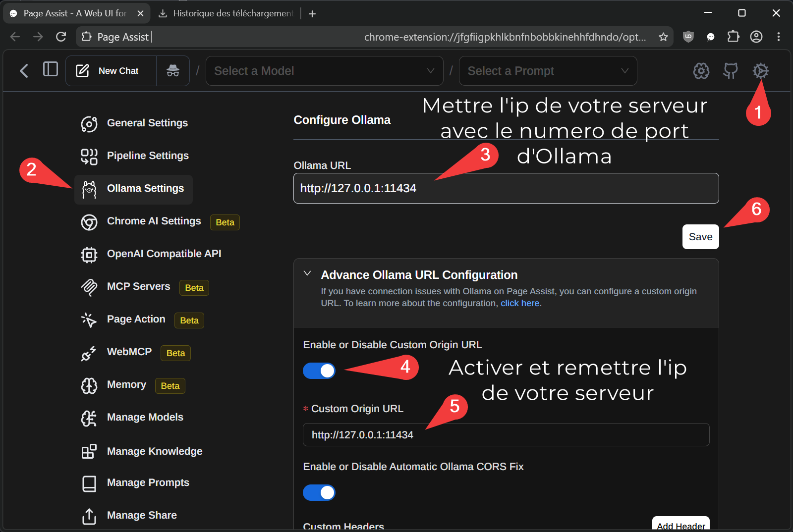

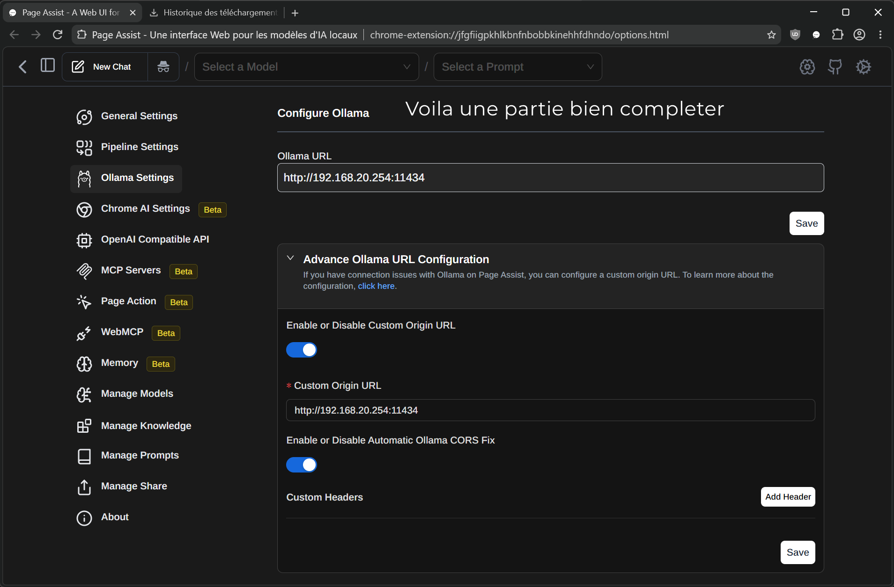

##### Peut on modifier le contexte d'un LLM local et si oui comment?

**Contexte** : Le contexte d'un LLM désigne l'ensemble des informations textuelles que le modèle est capable de lire, de "garder en mémoire" et de traiter en une seule fois pour générer sa réponse.  
Pour faire une analogie humaine, le contexte est l'équivalent de la mémoire à court terme ou de la taille du bureau sur lequel le modèle travaille.

Le contexte se compose généralement de trois éléments principaux :

* Le prompt système (System Prompt) : Les instructions de base données au modèle (ex: "Tu es un traducteur bilingue").
* L'historique de la conversation : Les messages précédents que vous et l'IA avez échangés au cours de la session.
* Les données externes (si présentes) : Un document complet, un article de blog ou un extrait de code que vous fournissez au modèle pour qu'il l'analyse.

###### Procédure de création du Modelfile

1. Faire un fichier en txt dans notre cas un modelfile.txt


1. Ensuite modifier avec ces paramètres :

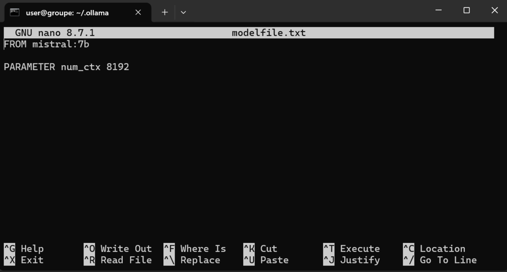

> [!NOTE]
> `**FROM mistral:7b**` : Utilise le modèle de base Mistral 7B ( changez le modèle selon votre modèle).
>
> `**PARAMETER num_ctx 8192**` : Augmente la fenêtre de contexte à **8 192 tokens** _(par défaut sur Ollama, elle est souvent bridée à 2 048)_. Cela permet au modèle de se souvenir d'un historique de conversation plus long ou d'analyser des documents plus volumineux _(attention : consomme un peu plus de VRAM/RAM)_.

1. ```sh
     ollama create mistral-modified -f ./modelfile.txt
    ```

    Permet d'ensuite d'utiliser ensuite le modelfile pour faire une copie de votre modèle avec le nom que vous aurez choisi avec une nouvelle instance.

##### Comment faire ingérer à votre LLM local le contenu d'un dossier avec quelques PDF?

Pour ajouter directement des fichiers, insérez-les dans l'interface web (par exemple dans Page Assist) :

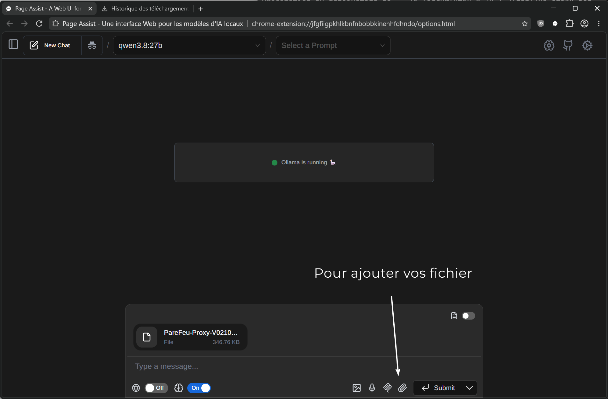

##### Comment modifier le comportement général de notre LLM Local à l'aide d'un fichier ?

Le comportement d'une ia est normalement neutre et **généraliste**. En la modifiant , cela permet de changer sa manière de changer, son degré de liberté (créativité vs logique),sa posture / son rôle, son style et son ton ou ses limites et interdictions.

###### Procédure

1. Faire un fichier en txt dans notre cas un modelfile.txt

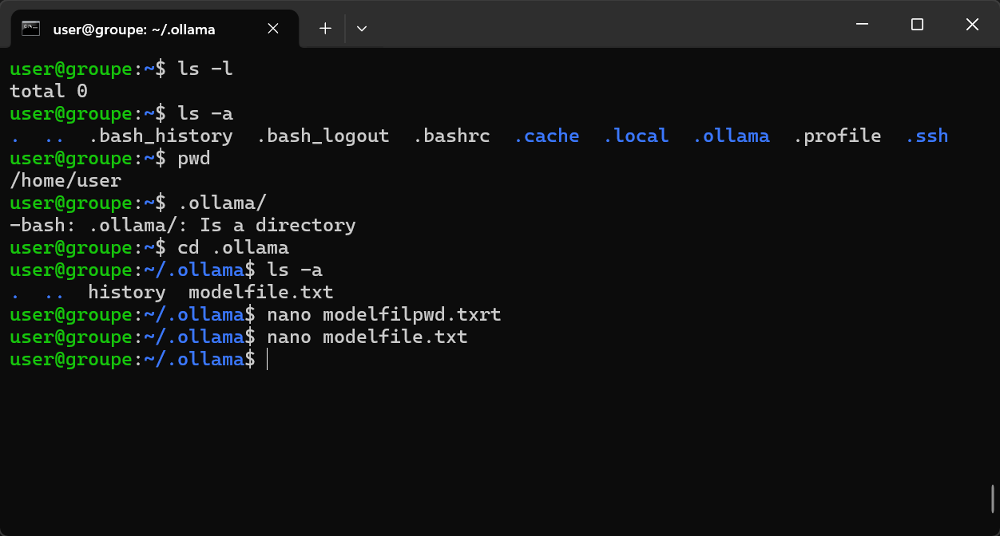

1. Ensuite modifier avec ces paramètres :

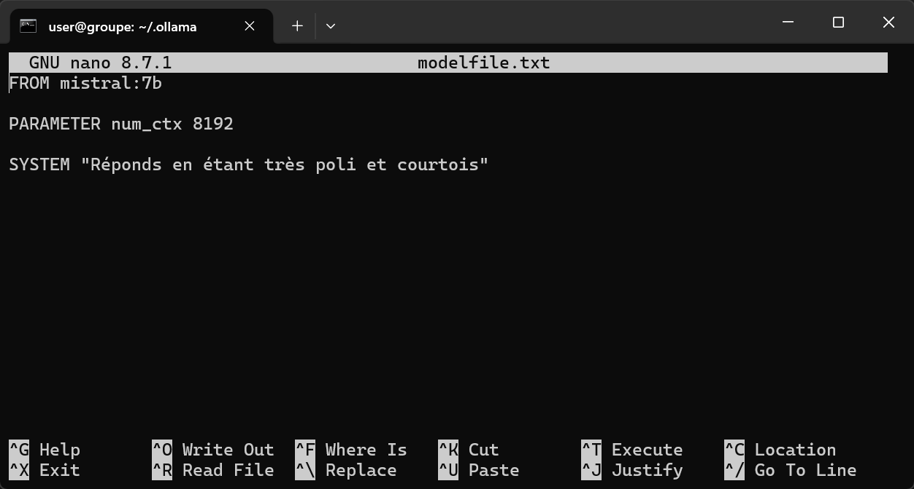

>[!NOTE]
> `**FROM mistral:7b**` : Utilise le modèle de base Mistral 7B ( changez le modèle selon votre modèle).
>
> `**PARAMETER num_ctx 8192**` : Augmente la fenêtre de contexte à **8 192 tokens** _(par défaut sur Ollama, elle est souvent bridée à 2 048)_. Cela permet au modèle de se souvenir d'un historique de conversation plus long ou d'analyser des documents plus volumineux _(attention : consomme un peu plus de VRAM/RAM)_.
>
> `**SYSTEM "..."**` : Définit la consigne système (le comportement/ton de l'IA).

1. ```sh
    ollama create mistral-modified -f ./modelfile.txt
    
    ```

> [!TIP]
> Permet d'ensuite d'utiliser ensuite le modelfile pour faire une copie de votre modèle avec le nom que vous aurez choisi avec une nouvelle instance

##### Prouver que votre LLM local à pu ingérer correctement les données de fichiers PDF

> <!--« Impossible dans mon environnement, mais cela a fonctionné sans problème sur le serveur. »-->

[404](img/404.png)

##### Comment forcer votre LLM local à aller chercher ce qu'il ne sait pas sur Internet, est-ce possible? et si oui comment?

> > <!--« Impossible dans mon environnement, mais cela a fonctionné sans problème sur le serveur. »-->  
> Voila comment faire .

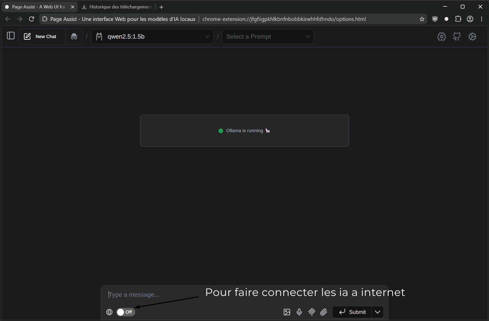

---

## Lexique IA

* [ ] À faire

* Inférence
* RAG
* ChatBot :
* Paramètre
* DataSet
* Agent IA
* Modèle
* Réseau de Neurones
* Machine Learning :les systèmes apprennent des motifs à partir des données plutôt que d'être programmés explicitement
* NLP
* Qwen
* Deep Learning : sous catégorie du ML utilisant des réseaux de neurones à plusieurs couches
* GPT
* IA Adpatative
* IA Générale
* Ollama
* IA Générative
* Singularité Technologique
* LLM
* Hallucination
* Embedding
* Token
* European AI Act
* Prompt
* Algorithme
* Test de Turing
* Big Data
* Biais
* ModelFile
* SystemPrompt
* Deep Learning
* Données

<!--#### _**Glossaire**_

1.  ###### Les fondations (données & calcul)

*   Données — la matière première brute
*   Big Data — données à très grand volume/vitesse/variété
*   DataSet — un ensemble de données structuré, utilisé pour entraîner ou tester un modèle
*   Algorithme — la suite de règles/instructions qui traite les données

2.  ###### La grande famille de l'IA (hiérarchie d'inclusion)

*   Machine Learning — les systèmes apprennent des motifs à partir des données plutôt que d'être programmés explicitement
*   Deep Learning — sous catégorie du ML utilisant des réseaux de neurones à plusieurs couches
*   Réseau de Neurones — la structure mathématique inspirée du cerveau, brique de base du Deep Learning
*   Paramètre — les valeurs internes ajustées pendant l'entraînement du réseau (plus il y en a, plus le modèle est "gros")
*   Modèle — le résultat entraîné — un réseau de neurones + ses paramètres, prêt à faire des prédictions3.

3.  ###### Domaines d'application du Deep Learning

*   NLP (Traitement du Langage Naturel) — la branche dédiée au texte/langage
    *   LLM (Large Language Model) — un modèle de NLP à très grande échelle (Deep Learning appliqué au texte)
        *   GPT, Qwen — des exemples concrets de LLM

4.  ###### Types d'IA selon la fonction

*   IA Générative — génère du contenu nouveau (texte, image...) → c'est la catégorie des LLM comme GPT/Qwen
*   IA Adaptative — s'ajuste en continu à son environnement/utilisateur
*   IA Générale (AGI) — IA hypothétique capable de tout type de tâche cognitive humaine (pas encore atteinte)

5.  ###### Le fonctionnement d'un LLM (le cycle d'utilisation)

*   Prompt — l'instruction/question envoyée au modèle
*   SystemPrompt — un prompt caché, défini en amont, qui fixe le comportement général du modèle
*   Token — l'unité de découpage du texte (mot/sous-mot) traitée par le modèle
*   Embedding — la représentation mathématique (vecteur) d'un token/texte, qui capture son sens
*   Inférence — le moment où le modèle utilise ses paramètres pour produire une réponse à partir d'un prompt (≠ entraînement)
*   Hallucination — un défaut de l'inférence : le modèle génère une information fausse avec assurance

6.  ###### Construire des applications autour d'un LLM

RAG (Retrieval-Augmented Generation) — technique qui connecte un LLM à une base de données externe pour améliorer sa précision et limiter l'hallucination Agent IA — un LLM auquel on donne la capacité d'agir (utiliser des outils, enchaîner des actions) de façon autonome ChatBot — une application conversationnelle, souvent construite sur un LLM

7.  ###### Outils pour faire tourner des modèles

*   Ollama — un outil pour exécuter des LLM en local
*   ModelFile — le fichier de configuration d'Ollama qui définit comment un modèle doit être lancé (paramètres, SystemPrompt inclus...)

8.  ###### Risques, limites & cadre

*   Biais — distorsions injustes héritées des données d'entraînement
*   Hallucination — (déjà vu ci-dessus)
*   European AI Act — le cadre réglementaire européen encadrant l'usage de l'IA
*   Test de Turing — critère historique pour évaluer si une IA "pense" comme un humain
*   Singularité Technologique — hypothèse d'un point où l'IA dépasserait l'intelligence humaine, liée au concept d'IA Générale -->
---

### THM

[TryHackMe | Roylee](https://tryhackme.com/p/Roylee)

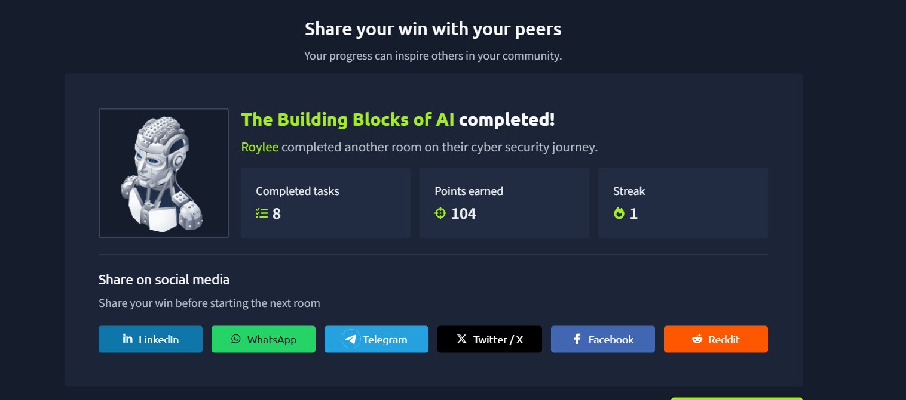

---

### VMWARE

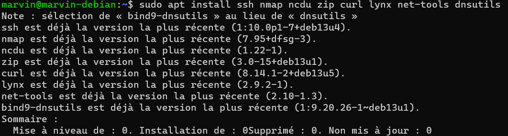

---

### WSL

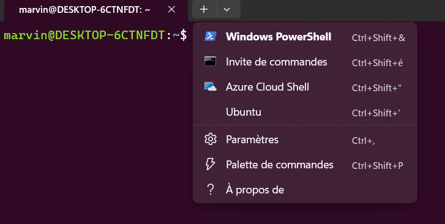

> [!NOTE]
> Merci à Fabien, Jordan, Juninho, Lucien et Lino pour leur aide.
